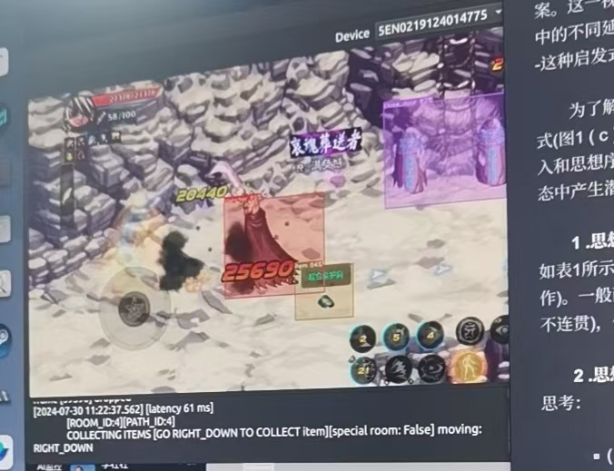

# DNFm  Auto Work Bot

## py DNFm自动搬砖bot

### 免责声明

该项目仅用于学习交流，使用过程中出现的任何问题均需自行承担！

### 概述

DNFm自动搬砖bot，全自动刷图搬炉岩碳。

基于scrcpy协议串流，使用qt制作了前端，支持自定义按键映射配置，可以用于其他手游。

使用YOLOv8进行图像识别（ 需要自行搭建yolo环境）。

出于防止滥用考虑，模型权重文件和及模型训练相关流程不会放出。

包含功能：

1. 敌人识别与自动战斗
2. 寻路控制（使用cv2判断小地图位置）
3. 自动进行下一局
4. 自动捡物品
5. 固定房间特殊技能释放
6. 自动翻牌子

支持的游戏角色：

1. 枪炮师
2. 阿修罗

其他角色需要自己进行角色定义和模型训练，每个角色可以有不同的技能组搭配。

### 运行效果

### 支持情况

#### PC端： 

支持 windows（>10)、Linux操作系统（只在Ubuntu 22.04上经过测试）

#### 手机端：

由于scrcpy使用adb进行通信，需要启用usb调试功能。

不支持IOS、Harmony OS next 操作系统的手机。

### 其他

由于作者已于半年前弃坑游戏，项目代码和游戏相关设置可能存在过期问题。

已不再维护和更新，如果有问题请自己尝试解决。
